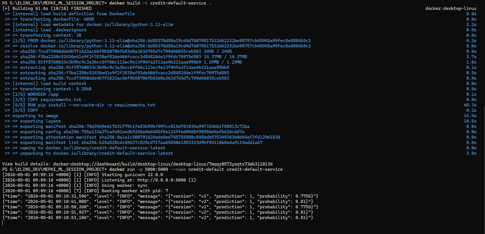
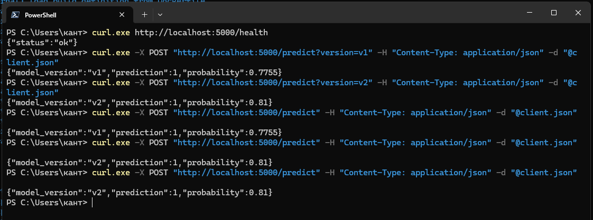
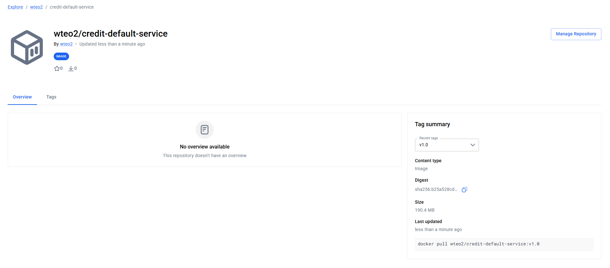

# Credit Default Service

Сервис прогнозирования дефолта по кредитным картам. Учебный проект по курсу «Внедрение моделей машинного обучения».

## Описание

Модель предсказывает, допустит ли клиент дефолт по кредитной карте в следующем месяце

## Структура репозитория

```
credit-default-service/
├── data/               # данные (UCI_Credit_Card.csv, test_data.csv)
├── models/             # обученные модели (model_v1.pkl, model_v2.pkl)
├── notebooks/          # EDA (eda.ipynb)
├── src/
│   ├── train.py        # обучение и сохранение моделей
│   └── predict.py      # загрузка модели и инференс
├── app/
│   └── api.py          # Flask API
├── ab_test/
│   └── ab_analysis.py  # A/B анализ (z-тест, доверительные интервалы)
├── tests/
│   └── test_api.py     # тесты API
├── Dockerfile
├── docker-compose.yml
├── requirements.txt
├── README.md
├── AB_TEST_PLAN.md     # план A/B-теста (гипотезы, метрики, критерии успеха)
└── ARCHITECTURE.md
```

## Запуск локально

Файл `models/model_v2.pkl` хранится через Git LFS — перед клонированием установите LFS:

```bash
git lfs install
git clone <repo-url>
```

```bash
# создать виртуальное окружение
python -m venv venv
venv\Scripts\activate  # Windows
# source venv/bin/activate  # Linux/Mac

# установить зависимости
pip install -r requirements.txt

# обучить модели (нужно один раз)
python src/train.py

# запустить сервис
python app/api.py
```

Сервис запустится на `http://localhost:5000`.

## Запуск через Docker

```bash
# собрать образ
docker build -t credit-default-service .

# запустить контейнер
docker run -p 5000:5000 credit-default-service
```

## Запуск через Docker Compose

```bash
docker-compose up
```

## Docker Hub

Образ опубликован: https://hub.docker.com/r/wteo2/credit-default-service

Скачать и запустить:

```bash
docker pull wteo2/credit-default-service:latest
docker run -p 5000:5000 wteo2/credit-default-service:latest
```

Доступные теги: `latest`, `v1.0`.

## API

### GET /health

Проверка работоспособности.

```bash
curl http://localhost:5000/health
```

Ответ:
```json
{"status": "ok"}
```

### POST /predict

Предсказание дефолта. Параметр `?version=v1` или `?version=v2`. Если версия не указана — выбирается случайно (50/50, A/B тест).

```bash
curl -X POST http://localhost:5000/predict?version=v1 \
  -H "Content-Type: application/json" \
  -d '{
    "LIMIT_BAL": 20000, "SEX": 2, "EDUCATION": 2, "MARRIAGE": 1, "AGE": 24,
    "PAY_0": 2, "PAY_2": 2, "PAY_3": -1, "PAY_4": -1, "PAY_5": -2, "PAY_6": -2,
    "BILL_AMT1": 3913, "BILL_AMT2": 3102, "BILL_AMT3": 689,
    "BILL_AMT4": 0, "BILL_AMT5": 0, "BILL_AMT6": 0,
    "PAY_AMT1": 0, "PAY_AMT2": 689, "PAY_AMT3": 0,
    "PAY_AMT4": 0, "PAY_AMT5": 0, "PAY_AMT6": 0
  }'
```

Ответ:
```json
{
  "model_version": "v1",
  "prediction": 1,
  "probability": 0.6723
}
```

**Поля запроса** (23 признака):

| Поле | Описание |
|------|----------|
| LIMIT_BAL | Размер кредитного лимита (NT$) |
| SEX | Пол (1=муж, 2=жен) |
| EDUCATION | Образование (1=магистратура, 2=университет, 3=школа, 4=другое) |
| MARRIAGE | Семейное положение (1=женат, 2=холост, 3=другое) |
| AGE | Возраст |
| PAY_0..PAY_6 | Статус оплаты за сентябрь..апрель 2005 |
| BILL_AMT1..6 | Сумма счёта за сентябрь..апрель 2005 (NT$) |
| PAY_AMT1..6 | Сумма платежа за сентябрь..апрель 2005 (NT$) |

**Поля ответа**:

| Поле | Описание |
|------|----------|
| prediction | 0 — нет дефолта, 1 — дефолт |
| probability | вероятность дефолта (0.0..1.0) |
| model_version | версия модели (v1 или v2) |

## Запуск тестов

```bash
python -m pytest tests/test_api.py -v
```

## Модели

Обе модели обучены с `class_weight='balanced'`, так как классы несбалансированы (~22% дефолтов).

| Версия | Алгоритм | F1 (класс 1) | Precision | Recall |
|--------|----------|-------------|-----------|--------|
| v1 | LogisticRegression | 0.461 | 0.367 | 0.620 |
| v2 | RandomForestClassifier | 0.448 | 0.647 | 0.343 |

v1 ловит больше дефолтов (выше Recall), v2 реже ошибается на нормальных клиентах (выше Precision). Какая лучше — зависит от стоимости ошибок для бизнеса (см. A/B анализ).

## A/B анализ

Полный план A/B-теста — в отдельном файле [`AB_TEST_PLAN.md`](AB_TEST_PLAN.md): гипотезы, метрики, статистические методы, критерии успеха.

Запуск анализа на тестовой выборке:

```bash
python ab_test/ab_analysis.py
```

Скрипт сравнивает модели с помощью z-теста для пропорций и строит 95% доверительный интервал разности recall.

## Демонстрация работы

Сервис запускался в Docker-контейнере, проверка через `curl` из другого окна PowerShell.

### 1. Запуск контейнера и логи API

```
[2026-05-01 09:09:16 +0000] [1] [INFO] Starting gunicorn 22.0.0
[2026-05-01 09:09:16 +0000] [1] [INFO] Listening at: http://0.0.0.0:5000 (1)
[2026-05-01 09:09:16 +0000] [1] [INFO] Using worker: sync
[2026-05-01 09:09:16 +0000] [7] [INFO] Booting worker with pid: 7
{"time": "2026-05-01 09:10:32,596", "level": "INFO", "message": "{"version": "v1", "prediction": 1, "probability": 0.7755}"}
{"time": "2026-05-01 09:10:41,008", "level": "INFO", "message": "{"version": "v2", "prediction": 1, "probability": 0.81}"}
{"time": "2026-05-01 09:10:50,260", "level": "INFO", "message": "{"version": "v1", "prediction": 1, "probability": 0.7755}"}
{"time": "2026-05-01 09:10:51,927", "level": "INFO", "message": "{"version": "v2", "prediction": 1, "probability": 0.81}"}
{"time": "2026-05-01 09:10:53,106", "level": "INFO", "message": "{"version": "v2", "prediction": 1, "probability": 0.81}"}
```



### 2. Примеры curl-запросов

Для удобства в PowerShell JSON-тело запроса сохранено в файл `client.json`.

**Проверка здоровья сервиса:**
```powershell
curl.exe http://localhost:5000/health
```
Ответ:
```json
{"status":"ok"}
```

**Предсказание моделью v1 (LogisticRegression):**
```powershell
curl.exe -X POST "http://localhost:5000/predict?version=v1" -H "Content-Type: application/json" -d "@client.json"
```
Ответ:
```json
{"model_version":"v1","prediction":1,"probability":0.7755}
```

**Предсказание моделью v2 (RandomForest):**
```powershell
curl.exe -X POST "http://localhost:5000/predict?version=v2" -H "Content-Type: application/json" -d "@client.json"
```
Ответ:
```json
{"model_version":"v2","prediction":1,"probability":0.81}
```

**A/B режим (без параметра version — случайное распределение 50/50):**
```powershell
curl.exe -X POST "http://localhost:5000/predict" -H "Content-Type: application/json" -d "@client.json"
```
Три запроса подряд — видно, как случайно выбирается версия:
```json
{"model_version":"v1","prediction":1,"probability":0.7755}
{"model_version":"v2","prediction":1,"probability":0.81}
{"model_version":"v2","prediction":1,"probability":0.81}
```



### 3. Образ на Docker Hub



Ссылка: https://hub.docker.com/r/wteo2/credit-default-service
